 

 

 

 

 

 

 

 

<table>
<tr>
<td align="center">

<strong>MyReddit</strong>
  

</td>
<td align="center">

<strong>E-commerce Platform</strong>
  

</td>
</tr>
<tr><td colspan="2"></td></tr>
<tr>
<td align="center">

<strong>Resume Builder</strong>
  

</td>
<td align="center">

<strong>Quiz App</strong>
  

</td>
</tr>
</table>

 

 

<picture>
  <source media="(prefers-color-scheme: dark)" srcset="https://github-readme-stats.vercel.app/api?username=Nattie-Nkosi&show_icons=true&hide_border=true&bg_color=0f172a&title_color=3b82f6&icon_color=8b5cf6&text_color=94a3b8&ring_color=3b82f6" />
  <source media="(prefers-color-scheme: light)" srcset="https://github-readme-stats.vercel.app/api?username=Nattie-Nkosi&show_icons=true&hide_border=true&bg_color=0f172a&title_color=3b82f6&icon_color=8b5cf6&text_color=94a3b8&ring_color=3b82f6" />
  
</picture>
&nbsp;&nbsp;
<picture>
  <source media="(prefers-color-scheme: dark)" srcset="https://github-readme-streak-stats.herokuapp.com/?user=Nattie-Nkosi&hide_border=true&background=0f172a&ring=3b82f6&fire=8b5cf6&currStreakLabel=3b82f6&sideLabels=94a3b8&currStreakNum=e2e8f0&sideNums=e2e8f0&dates=64748b" />
  <source media="(prefers-color-scheme: light)" srcset="https://github-readme-streak-stats.herokuapp.com/?user=Nattie-Nkosi&hide_border=true&background=0f172a&ring=3b82f6&fire=8b5cf6&currStreakLabel=3b82f6&sideLabels=94a3b8&currStreakNum=e2e8f0&sideNums=e2e8f0&dates=64748b" />
  
</picture>

  

 

 

 

